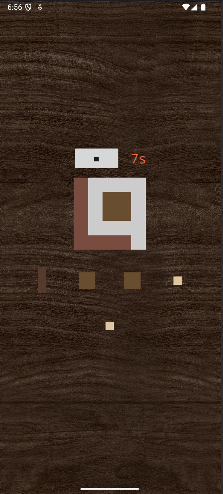
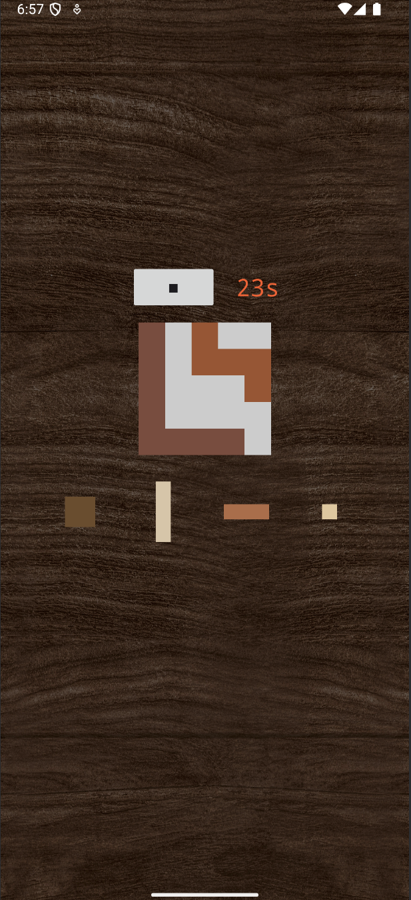

# PuzzleApp - Tetirs-ähnliches Puzzle Game
Dies ist eine Android-Applikation, die im Rahmen des Projektfachs im Sommersemester 2025 entwickelt wurde.
Die App bietet ein Tetris-ähnliches Spiel, bei dem verschieden geformte Blöcke in ein Raster gesetzt werden müssen.
Ziel ist es, alle Formen korrekt im Spielfeld anzuordnen, ohne dass Lücken entstehen.

## 🎯 Features
* **🎮Interaktives Puzzle-Gameplay** Positioniere verschiedene Formen per Klick in das Spielfeld.
* **🧠 Logik-basiertes Spielprinzip** Das Spiel nutzt ein 2D-Array, um belegte und freie Felder zu verwalten.
* **🔄 Kollisionserkennung & Platzprüfung:** Die App prüft automatisch, ob eine Form korrekt gesetzt werden kann.
* **📐 Variation der Formen** Unterschiedliche Blöcke ähnlich wie bei Tetris, aber mit Puzzle-Charakter.

## 🛠 Technische Details
* **Entwicklungsumgebung:** Android Studio
* **Programmiersprache:** Java
* **Mind. Android-Version:** API Level 21 (Android 5.0)
* **Architektur:**
    * Spiellogik basiert auf einem zweidimensionalen Integer-Array
    * Jede Form ist als eigene Datenstruktur mit Formmatrix umgesetzt

## 🚀 Installation
1.  Repo klonen.
2.  In Android Studio öffnen.
3.  App auf Emulator oder Android-Gerät starten.

## 📸 Screenshots

   
   

   
   

